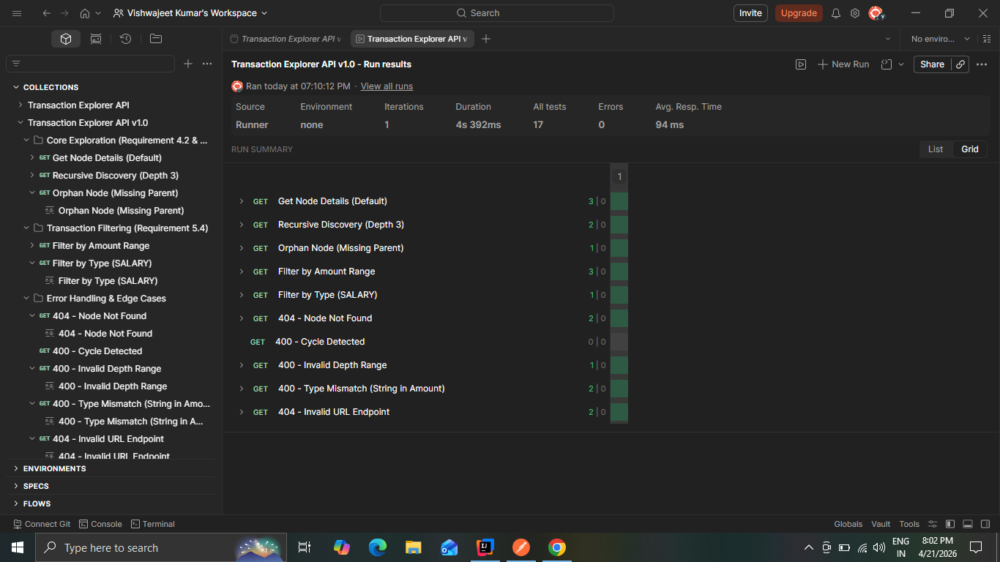
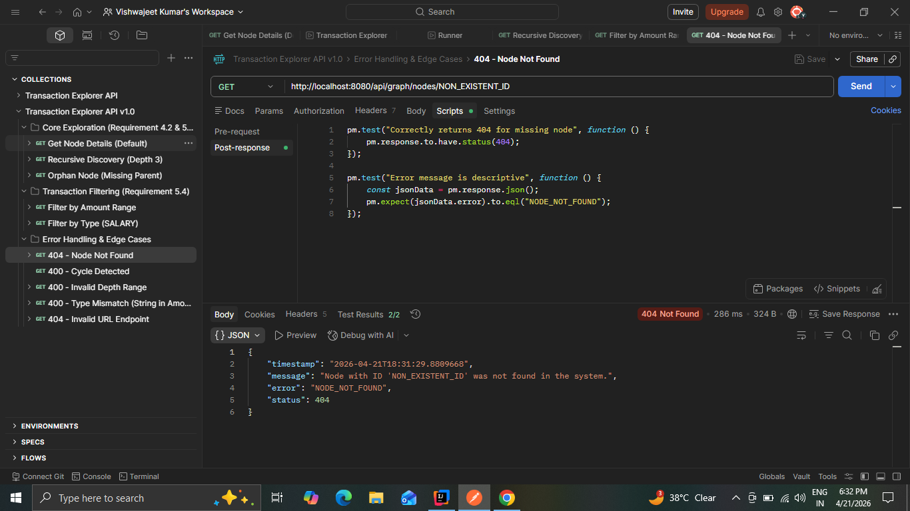

**Transaction Explorer API**

A high-performance Spring Boot API designed to navigate and analyze hierarchical transaction data. This project implements graph traversal logic to classify nodes (Root, Leaf, Orphan) and detect cycles within financial data structures.

🚀 Key Features
Graph Classification: Automatically identifies Root, Leaf, and "Pseudo-Root" (Orphan) nodes.

Recursive Discovery: Traverses the graph to a specified maxDepth to retrieve sub-hierarchies.

Cycle Detection: Implements a Depth-First Search (DFS) algorithm to catch and prevent infinite loops in data.

Transaction Filtering: Built-in filtering for transaction amounts and types (e.g., SALARY).

🛠️ Tech Stack
Java 17 / Spring Boot 3.x

Maven (Build Tool)

Postman (Automated Testing)

📋 Getting Started
1. Clone & Run
   Bash
   git clone https://github.com/vishwajeetkr96-hash/transaction-explorer-api.git
   cd transaction-explorer-api
   ./mvnw spring-boot:run
   The API will be available at http://localhost:8080.

2. Import Postman Collection
   I have included a full test suite in the root directory:

File: Transaction_Explorer_API.postman_collection.json

How to import:

Open Postman.

Click the Import button.

Drag and drop the .json file from this project folder.

🧪 Testing Suite
The included Postman collection features Automated Assertion Scripts. Every request is tested for:

Schema Validation: Ensuring the JSON response structure is correct.

Logic Verification: Confirming isRoot and isLeaf flags match the data state.

Error Handling: Verifying correct 400 and 404 status codes for edge cases.

Running All Tests
Click on the Transaction Explorer API v1.0 collection in Postman.

Click Run.

Ensure all tests show a green PASSED status.

📂 Project Structure
src/: Application source code.

DESIGN.md: Technical breakdown of the DFS logic and Orphan handling.

Transaction_Explorer_API.postman_collection.json: The full API test suite.

Note: For a deep dive into the algorithm choices and complexity analysis, please refer to the DESIGN.md file.